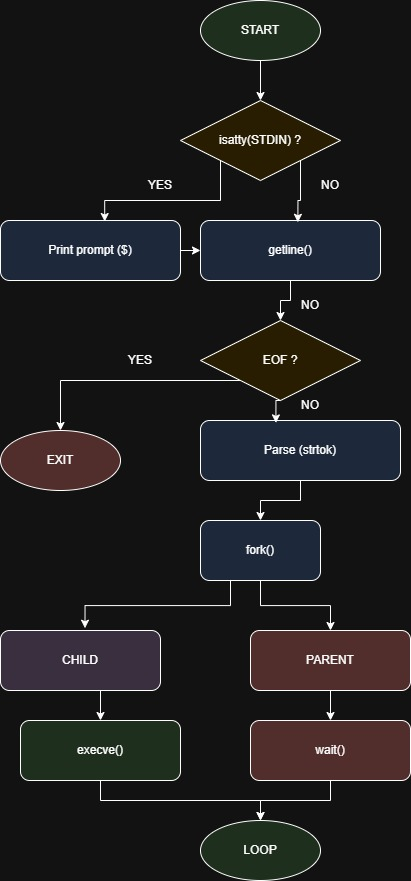

# holbertonschool-simple_shell

## Description
Simple Shell is a basic UNIX command line interpreter written in C.

This project reproduces a minimal version of the standard shell `/bin/sh`.
It allows users to execute commands in both interactive and non-interactive modes.

The goal is to understand how a shell works internally by handling processes,
system calls, and command parsing.

---

## Flow of execution

The shell follows this logic:

1. Display a prompt (interactive mode only)
2. Read user input using `getline`
3. Parse the command into tokens
4. Create a child process using `fork`
5. Execute the command with `execve`
6. Wait for the child process using `wait`
7. Repeat until EOF or `exit`

---

## Features

- Interactive mode (prompt `$`)
- Non-interactive mode (pipe support)
- Execution of commands with full path (`/bin/ls`)
- Process creation using `fork`
- Program execution using `execve`
- Process synchronization using `wait`
- Error handling (command not found)

---
## Compilation
```bash
gcc -Wall -Werror -Wextra -pedantic -std=gnu89 *.c -o hsh
```
## Flowchart

<p align="center">
  
</p>

## Authors

- Sebastien Lamblin
- Leo Lebtahi

---

## Manual

A manual page is available:

```bash
man ./man_1_simple_shell
```

## Project GitHub Flow

For this project we will use externals ressources in order to have a nice collaboration flow.

Using keywords to prefix branches and commits messages like:

- feat
- docs
- fix

<u>examples</u>:\
branch -> "feat/build-main-header"\
commit -> "docs: adding gitflow chapter to readme"

### How to push my work ?

In order to make a new feature, fix or documentation I need to make a new branch as explain above. 
```bash
git checkout -b <branch-name>
```

When work is done I fetch the parent branch (dev) to see there is some change, if there are changes I need to pull and merge.
```bash
git checkout dev
git fetch
git pull
git checkout <working-branch>
git merge dev
```
This process avoids breaking dev or main branch. So I need to resolve conflict on my working branch before making a PR on GitHub and merge on dev.

If I have a new PR from my coworker I need to check his code and  comment if I have questions or validate the PR to merge.

## Ressources:

### Github Flow:
- https://githubflow.github.io/
- https://nvie.com/posts/a-successful-git-branching-model/

### Naming convention (branches and commits messages)
- https://buzut.net/cours/versioning-avec-git/bien-nommer-ses-commits
- https://codeheroes.fr/blog/git-comment-nommer-ses-branches-et-ses-commits/

### Markdown styling documentation
- https://google.github.io/styleguide/docguide/style.html